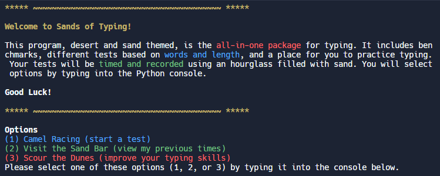
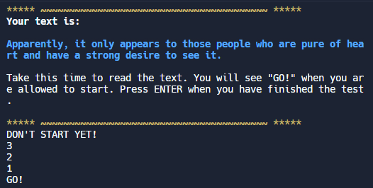
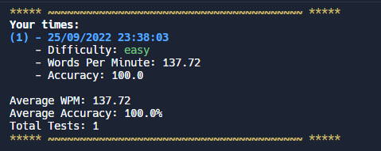

<h1>Sands of Typing</h1>
CS assignment - typing test in the command line, made with Python 
<a href = 'https://replit.com/@jerfara1/Sands-of-Typing?v=1'>Repl Link</a>

## About
Sands of Typing is a typing test program in the command line, made with the Python programming language. It was made for a class assignment. Themed around deserts and sand, Sands of Typing hopes to be a simple, all-in-one typing program.

## Screenshots
Home page 

Typing test 

Previous times 

## Copy-Paste Proof
Since this program runs in the command line, it is immune to the Ctrl+C copy command. Ctrl+C is the escape shortcut, and causes a KeyboardInterruptError in Python 3.
