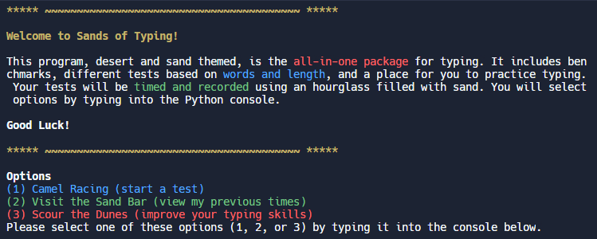
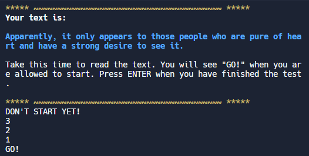
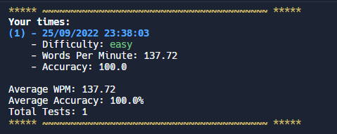

# Sands of Typing
CS assignment - typing test in the command line, made with Python

## About
Sands of Typing is a typing test program in the command line, made with the Python programming language. It was made for a class assignment. Themed around deserts and sand, Sands of Typing hopes to be a simple, all-in-one typing program.

## Screenshots
Home page

Typing test

Previous times

## Contributing
To contribute, press the "Fork" button on GitHub. Then, open this repo using your IDE of choice and create a new branch. Commit some changes, then create a pull request, which will be reviewed. 

To contribute texts, add them to the arrays in main.py. Here are the benchmarks:

Easy: 0-150 
Medium: 150-250 
Hard: 250+